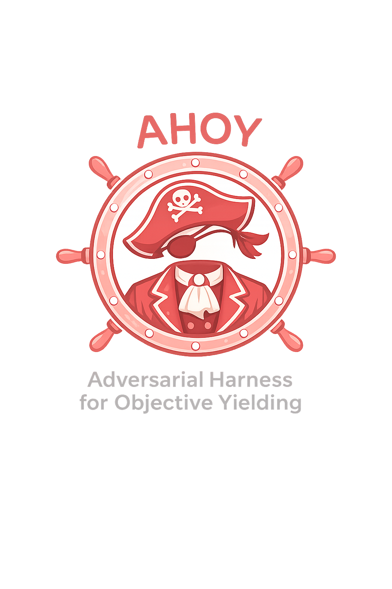
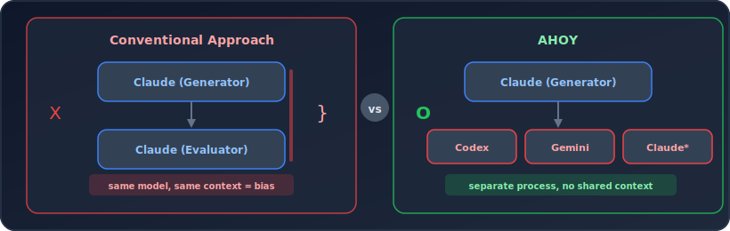
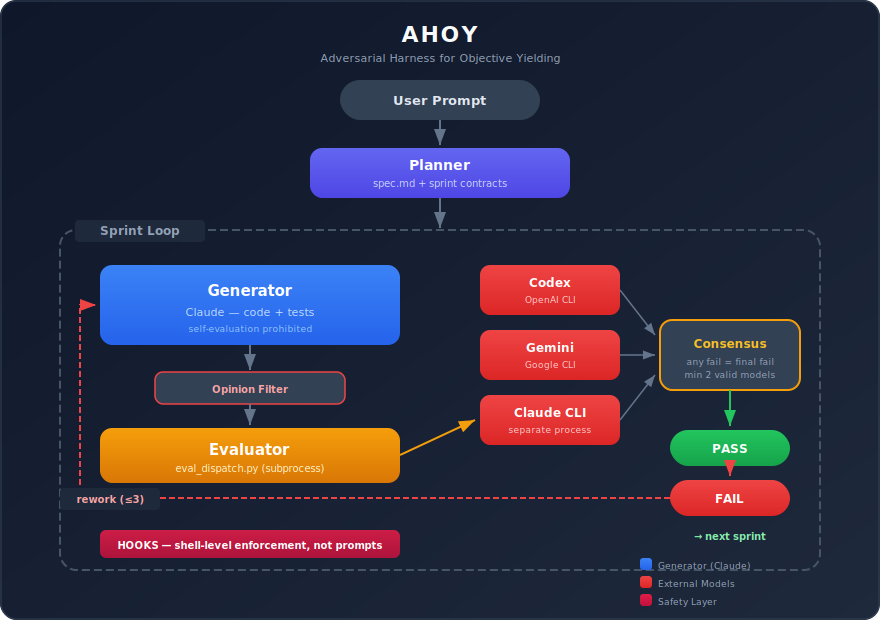
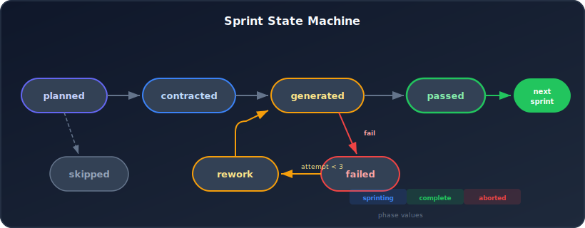

<div align="center">



# AHOY

### Agent Harness for Orchestrated Yielding

**AI 코딩 에이전트가 생성한 코드를, AI 코딩 에이전트가 아닌 외부 모델이 평가한다.**

[](#requirements)
[](#installation)
[](#license)

[설치](#설치) · [아키텍처](#아키텍처) · [동작 방식](#동작-방식) · [스킬](#스킬) · [안전 장치](#안전-장치) · [로드맵](#로드맵)

**[English](../README.md)** | **[한국어](README.ko.md)**

</div>

---

## 문제

AI 코딩 에이전트는 자기가 쓴 코드를 자기가 평가한다. 같은 모델, 같은 컨텍스트, 같은 편향.

<p align="center">
  
</p>

## 해결

AHOY는 **Generator와 Evaluator를 물리적으로 분리**한다.

- Generator(Claude)가 코드를 쓰면, **별도 프로세스**의 외부 모델(Codex, Gemini, Claude CLI)이 평가한다.
- Claude는 외부 모델의 판정을 **읽기만** 할 수 있고, **변경할 수 없다**.
- Hook 시스템이 규칙 위반을 **shell 레벨에서 차단**한다 — 프롬프트 우회 불가.

---

## 설치

AHOY는 **Claude Code 플러그인**입니다. 2단계로 설치합니다:

```bash
# 1. 마켓플레이스 추가 & 설치
/plugin marketplace add Daeil-Jung/ahoy
/plugin install ahoy

# 2. 환경 점검
/ahoy:ahoy-setup
```

> `/ahoy:ahoy-setup`은 Python, uv, 외부 모델 CLI를 점검하고 누락된 항목의 설치 방법을 안내합니다.

### 요구사항

| 도구 | 버전 | 용도 |
|------|------|------|
| [Claude Code](https://claude.ai/code) | latest | 하네스 실행 환경 |
| [Codex CLI](https://github.com/openai/codex) | latest | 외부 평가 모델 #1 |
| [Gemini CLI](https://github.com/google-gemini/gemini-cli) 또는 [Claude CLI](https://docs.anthropic.com/en/docs/claude-cli) | latest | 외부 평가 모델 #2 |
| Python | 3.12+ | eval_dispatch.py 실행 |

> 최소 2개 외부 모델 CLI가 설치되어야 컨센서스가 성립합니다.

<details>
<summary>대안: 로컬 개발 모드</summary>

```bash
claude --plugin-dir /path/to/ahoy
```
</details>

### 사용법

```bash
# 새 프로젝트 시작
/ahoy <프로젝트 요청>

# 중단된 하네스 재개
/ahoy

# 개별 단계 실행 (보통 Orchestrator가 자동 호출)
/ahoy:ahoy-plan <요청>
/ahoy:ahoy-gen
/ahoy:ahoy-eval
```

---

## 아키텍처

<p align="center">
  
</p>

### 스프린트 상태 머신

<p align="center">
  
</p>

| 상태 | 설명 |
|------|------|
| `planned` | 스프린트 계약 생성, 사용자 확인 대기 |
| `contracted` | 사용자 승인, Generator 실행 준비 |
| `generated` | 코드 구현 완료, 외부 평가 대기 |
| `passed` | 외부 컨센서스 = pass |
| `failed` | 외부 컨센서스 = fail, rework 필요 |
| `rework` | 외부 모델이 발견한 이슈 수정 중 |
| `skipped` | 사용자가 이 스프린트를 건너뜀 |

---

## 동작 방식

### 1. Plan

Planner가 사용자 요청을 분석하여 **스프린트 계약**으로 분해한다.

```
사용자: "JWT 인증 + 사용자 CRUD API 만들어줘"
                    │
                    ▼
  sprint-001: JWT 인증 (AC 3개)
  sprint-002: 사용자 CRUD (AC 4개)
  sprint-003: 권한 관리 (AC 3개)
```

각 계약에는 **검증 가능한 인수 기준(Acceptance Criteria)**이 포함된다:
- **좋음**: `POST /api/users → 201 반환, DB에 유저 레코드 생성`
- **나쁨**: `사용자 관리 기능 구현`

### 2. Generate

Generator(Claude)가 계약에 맞게 코드와 테스트를 구현한다.

- contract.md의 범위만 구현 (범위 밖 변경 금지)
- 각 AC에 대응하는 실행 가능한 테스트 작성
- **자기평가 금지** — "pass", "충족", "통과" 등의 판단을 기록하지 않음

### 3. Evaluate

**외부 모델이 별도 프로세스에서** Generator의 코드를 평가한다.

```bash
python ${CLAUDE_PLUGIN_ROOT}/scripts/eval_dispatch.py \
  .claude/harness/sprints/sprint-001 \
  --models codex,claude \
  --project-root .
```

```json
{
  "verdict": "pass",
  "model_verdicts": {"codex": "pass", "claude": "pass"},
  "issues": [],
  "passed_criteria": ["AC-001", "AC-002", "AC-003"]
}
```

**컨센서스 규칙**: 하나라도 fail → 최종 fail. 하나라도 `partial_pass` → 최종 `partial_pass`. 유효 모델 2개 미만 → error.

`issues.json`에는 두 가지가 함께 기록됩니다:
- `verdict` — 외부 모델 컨센서스 원본 (`pass`, `partial_pass`, `fail`, `error`)
- `status_action` — 하네스 상태 전이 결정 (`passed`, `failed`, `error`)

minor 이슈만 있는 `partial_pass`는 `status_action: "passed"`로 처리됩니다. blocker/major 이슈가 있으면 `status_action: "failed"`입니다.

모델 호출은 `ThreadPoolExecutor`로 **병렬** 실행되어 평가 시간을 단축한다.

### 4. Rework or Advance

- **pass** → 다음 스프린트로 이동
- **fail** → 외부 모델이 발견한 이슈를 기반으로 rework (최대 3회)
- **3회 실패** → 사용자에게 판단을 위임

---

## 스킬

AHOY는 Claude Code **스킬**(레거시 커맨드가 아닌)을 사용하여 플러그인 호환성을 보장합니다.

| 스킬 | 역할 | 설명 |
|------|------|------|
| **`/ahoy`** | **Orchestrator** | **전체 라이프사이클 관리. 이 스킬 하나면 충분** |
| `/ahoy:ahoy-setup` | **Setup** | **환경 점검 및 진단** |
| `/ahoy:ahoy-plan` | Planner | 요청 → spec.md + sprint contracts 생성 |
| `/ahoy:ahoy-gen` | Generator | contract.md 기반 코드/테스트 구현 (Claude) |
| `/ahoy:ahoy-eval` | Evaluator | 외부 모델 평가 디스패치 + 결과 기록 |

> 서브 스킬(`ahoy-plan`, `ahoy-gen`, `ahoy-eval`)은 `disable-model-invocation: true` 설정으로 오케스트레이터만 호출합니다.

---

## 안전 장치

AHOY의 안전 장치는 **프롬프트가 아닌 shell 레벨**에서 동작한다.
Claude가 프롬프트를 무시하더라도, hook이 물리적으로 차단한다.

### Layer 1 — 파일 소유권 강제

```
issues.json → eval_dispatch.py(subprocess)만 작성 가능
              Claude의 Write/Edit → hook이 무조건 차단 (exit 1)
```

### Layer 2 — 상태 전이 가드

```
generated → passed 전이 시:
  ✓ issues.json 존재?
  ✓ 무결성 검증 통과?
  ✓ 유효 외부 모델 ≥ 2?
  ✓ verdict ↔ status 일관성?

  하나라도 실패 → 전이 차단 + 자동 롤백
```

### Layer 3 — Pre/Post Hook Matrix

| 시점 | Matcher | 스크립트 | 차단 조건 |
|------|---------|---------|----------|
| Pre | `Write\|Edit(*harness_state*)` | `pre-state-write` | 외부 평가 없이 generated에서 전이 |
| Post | `Write\|Edit(*harness_state*)` | `post-state-write` | passed ↔ verdict 불일치 → **자동 롤백** |
| Pre | `Write\|Edit(*issues.json*)` | `guard-eval-files` | Claude의 issues.json 직접 쓰기 (항상) |
| Pre | `Bash\|Agent(*ahoy-gen*)` | `pre-gen` | contract.md 없이 Generator 실행 |
| Post | `Bash(*eval_dispatch*)` | `post-eval` | verdict error/unknown, 유효 모델 < 2 |
| Pre | `Bash(git commit*)` | `pre-commit` | 테스트 실패 |
| Pre | `Bash(git push*)` | `pre-push` | 테스트 실패 또는 상태 불일치 |

Hook 스크립트는 `${CLAUDE_PLUGIN_ROOT}` 경로를 사용하여 플러그인 설치 위치에 무관하게 동작합니다.

### Layer 4 — Generator 의견 필터링

Generator의 보고서에서 주관적 판단("충족", "pass", "통과")을 **자동 제거**한 후 외부 모델에 전달한다.
사실 정보(파일 목록, 테스트 결과, 라인 수)만 남긴다.

---

## 플러그인 구조

```
ahoy/
├── .claude-plugin/
│   ├── plugin.json                  # 플러그인 매니페스트
│   └── marketplace.json             # 마켓플레이스 등록
├── .mcp.json                        # MCP 서버 설정 (Codex)
├── hooks/
│   └── hooks.json                   # 7개 강제 hook
├── skills/
│   ├── ahoy/SKILL.md               # 오케스트레이터
│   ├── ahoy-setup/SKILL.md         # 환경 점검
│   ├── ahoy-plan/SKILL.md          # Planner
│   ├── ahoy-gen/SKILL.md           # Generator
│   └── ahoy-eval/SKILL.md          # Evaluator
├── scripts/
│   ├── eval_dispatch.py             # 외부 모델 평가 디스패처 (병렬 호출)
│   └── validate_harness.py          # 상태 전이 검증 + 자동 롤백
├── templates/
│   ├── spec_template.md             # 프로젝트 스펙 템플릿
│   ├── sprint_contract_template.md  # 스프린트 계약 템플릿
│   ├── eval_report_template.md      # 평가 보고서 템플릿
│   └── handoff_template.md          # 컨텍스트 핸드오프 템플릿
├── docs/
│   ├── README.ko.md                 # 이 파일
│   └── assets/                      # SVG 다이어그램
├── CLAUDE.md                        # Claude Code 컨텍스트
└── README.md                        # English README
```

### 워크스페이스 (대상 프로젝트에 생성)

```
.claude/harness/
├── harness_state.json         # 마스터 상태
├── spec.md                    # Planner 출력
├── sprints/
│   └── sprint-NNN/
│       ├── contract.md        # 스프린트 계약
│       ├── gen_report.md      # Generator 보고 (사실 정보만)
│       ├── eval_report.md     # Evaluator 보고
│       └── issues.json        # 외부 모델 평가 결과 (Claude 쓰기 금지)
└── handoffs/
    └── handoff-NNN.md         # 컨텍스트 리셋 인수인계
```

---

## 설계 원칙

| # | 원칙 | 강제 방법 |
|---|------|----------|
| 1 | **Generator는 평가하지 않는다** | Hook이 자기평가 경로를 물리적으로 차단 |
| 2 | **스프린트 계약이 곧 진실** | Generator와 Evaluator가 동일한 contract.md 참조 |
| 3 | **파일 기반 통신** | JSON/MD 파일로 상태 공유, 메모리 의존 없음 |
| 4 | **컨센서스 필수** | 단일 모델 통과 방지, 최소 2개 유효 모델 |
| 5 | **컨텍스트 리셋** | 3 스프린트마다 핸드오프 문서로 새 세션 인계 |

---

## 지원 외부 모델

| 모델 | CLI | 명령어 | 상태 |
|------|-----|--------|------|
| OpenAI Codex | `codex` | `codex exec --yolo --ephemeral` | 지원 |
| Google Gemini | `gemini` | `gemini -p` | 지원 |
| Anthropic Claude | `claude` | `claude -p` (별도 프로세스) | 지원 |

> `eval_dispatch.py`의 `call_model()` 함수에 새 모델을 추가하여 확장 가능합니다.

---

## 로드맵

- [ ] Web UI 대시보드 — 스프린트 진행 현황 실시간 모니터링
- [ ] 평가 모델 플러그인 시스템 — CLI 외 API 직접 호출 지원
- [ ] 평가 결과 히스토리 분석 — 모델별 일치율, 이슈 패턴 트렌드
- [ ] CI/CD 통합 — GitHub Actions에서 AHOY 루프 실행
- [ ] 멀티 에이전트 Generator — 모델별 구현 → 최적 선택

---

## License

MIT

---

<div align="center">

**AHOY!** — *좋은 코드를 발견했을 때 외치는 말.*

</div>
