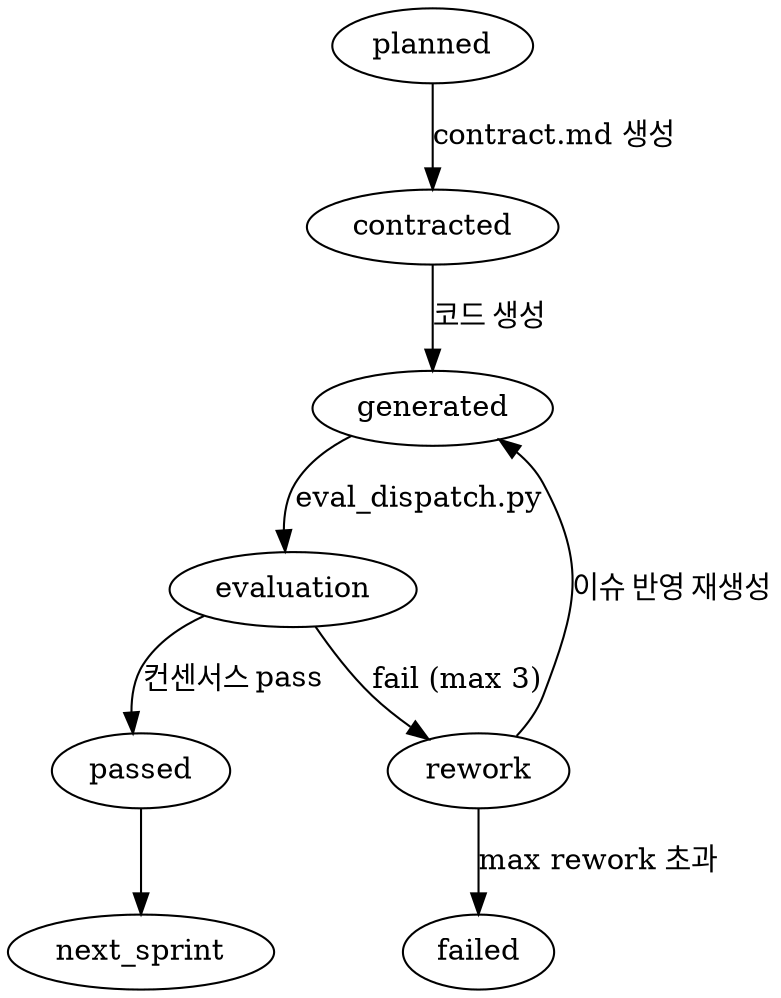

# Attractor (StrongDM) 분석 리포트

> 분석일: 2026-03-28 (10차)

## 기본 정보

| 항목 | 내용 |
|------|------|
| 프로젝트명 | Attractor |
| GitHub URL | https://github.com/strongdm/attractor |
| 스타 | 948 |
| 포크 | 155 |
| 최근 커밋 | 2026년 3월 활성 |
| 라이선스 | 오픈소스 |
| 언어 | NLSpec (자연어 명세), TypeScript 구현체 별도 |

## 핵심 아키텍처

### 개요
Attractor는 StrongDM의 Software Factory 제품으로, **자연어 명세(NLSpec)** 로 정의된 비대화형 코딩 에이전트다. DOT(Graphviz) 문법으로 다단계 AI 워크플로우를 선언적 그래프로 정의하고, 각 노드가 AI 태스크, 에지가 전이 조건을 표현한다.

### 구조
```
[NLSpec 명세 3종]
├── attractor-spec.md (오케스트레이션, 그래프, 상태 관리)
├── coding-agent-loop-spec.md (코딩 에이전트 루프)
└── unified-llm-spec.md (프로바이더 추상화)

[DOT 그래프 정의] → [Pipeline Runner]
      ↓
[Node 순회 (LLM 호출, 조건 분기, 병렬 팬아웃)]
      ↓
[SessionEvent 스트리밍]
      ↓
[수렴 또는 종료 조건 충족]
```

### 핵심 특징

1. **DOT 기반 선언적 파이프라인**: Graphviz DOT 문법으로 워크플로우 정의. 시각적, 버전 관리 가능
2. **NLSpec (자연어 명세)**: 코드가 아닌 자연어로 에이전트 동작을 명세. 구현은 별도 (TypeScript/C/Rust/Python 등)
3. **SessionEvent 시스템**: 17종 이벤트(SESSION_START, TOOL_CALL_START, LOOP_DETECTION, STEERING_INJECTED 등) 스트리밍
4. **Unified LLM SDK**: 프로바이더 무관 추상화. 각 어댑터가 네이티브 프로토콜 번역
5. **루프 감지 (LOOP_DETECTION)**: 에이전트가 같은 동작 반복 시 자동 감지 이벤트 발생
6. **스티어링 주입 (STEERING_INJECTED)**: 파이프라인 실행 중 외부에서 방향 보정 가능
7. **프로그래밍 가능한 루프**: 에이전트 루프가 라이브러리로, CLI가 아닌 API로 제어
8. **벤치마크 도구 (AttractorBench)**: NLSpec 명령 따르기 벤치마크 별도 제공
9. **다중 구현체**: TypeScript(brynary), C(jmccarthy), Rust(streamweave), pi.dev 등 커뮤니티 구현

## AHOY와 비교

### AHOY보다 나은 점

1. **선언적 그래프 파이프라인**: DOT 문법으로 워크플로우를 시각적으로 정의하고 버전 관리. AHOY는 코드 + Hook으로 워크플로우를 구성하지만 시각화 없음
2. **SessionEvent 17종 이벤트 스트리밍**: 모든 에이전트 동작을 구조화된 이벤트로 캡처. AHOY는 이벤트 스트리밍 시스템 없음
3. **루프 감지 (LOOP_DETECTION)**: 에이전트 무한 반복을 자동 감지. AHOY는 rework 3회 제한만, 같은 동작 반복 감지 없음
4. **스티어링 주입**: 실행 중 외부에서 방향 보정 가능. AHOY는 스프린트 실행 중 외부 개입 불가
5. **NLSpec (명세와 구현 분리)**: 명세를 자연어로 정의, 구현은 다양한 언어로 독립. 이식성과 표준화에 유리
6. **벤치마크 도구**: AttractorBench로 에이전트 명령 따르기 능력 정량 측정. AHOY에는 자체 벤치마크 없음
7. **프로그래밍 가능한 에이전트 루프**: API로 루프 제어, 외부 시스템 통합 용이. AHOY는 Claude Code 세션 내부에서만 작동

### AHOY가 더 나은 점

1. **Generator-Evaluator 분리**: Attractor는 단일 에이전트 파이프라인. 자기평가 편향 위험
2. **다중 모델 컨센서스**: Attractor는 파이프라인 노드별 단일 모델. AHOY는 최소 2개 모델 합의
3. **Hook 기반 하드 차단**: Attractor는 소프트 이벤트 기반. AHOY는 PreToolUse/PostToolUse 하드 차단
4. **파일 소유권 분리**: Attractor에는 파일 수준 접근 제어 없음
5. **Generator 의견 strip**: Attractor에는 의견 필터링 없음
6. **계약 기반 개발**: Attractor는 자유형 워크플로우. AHOY는 contract.md 기반 명확한 요구사항
7. **적대적 평가**: Attractor는 적대적 평가 메커니즘 없음

## 배울 만한 구체적 아이디어

### 1. DOT 기반 스프린트 워크플로우 시각화

- `.ahoy/workflow.dot` 파일로 현재 상태를 시각화, `ahoy status --graph`로 렌더링

### 2. SessionEvent 스트리밍 for Agent Trace
```python
# sprint_events.py
class SprintEventStream:
    EVENT_TYPES = [
        "SPRINT_START", "STATE_TRANSITION", "EVAL_REQUEST",
        "EVAL_RESPONSE", "CONSENSUS_RESULT", "REWORK_START",
        "HOOK_TRIGGERED", "HOOK_BLOCKED", "SPRINT_END",
        "LOOP_DETECTED", "STEERING_INJECTED"
    ]

    def emit(self, event_type, data):
        event = {
            "kind": event_type,
            "timestamp": datetime.now().isoformat(),
            "sprint_id": self.sprint_id,
            "data": data
        }
        self.write_to_log(event)  # .ahoy/events/{sprint_id}.jsonl
        self.notify_subscribers(event)  # 실시간 구독자 알림
```

### 3. 루프 감지 (LOOP_DETECTION)
```python
# rework 패턴 감지
class LoopDetector:
    def check(self, current_issues, history):
        """동일 이슈가 반복 등장하는 무한 루프 감지"""
        for prev in history[-3:]:
            overlap = set(current_issues) & set(prev["issues"])
            if len(overlap) / len(current_issues) > 0.8:
                return {
                    "loop_detected": True,
                    "recurring_issues": list(overlap),
                    "recommendation": "escalate_to_human"
                }
        return {"loop_detected": False}
```

---

## AHOY 개선 제안 Top 3

### 1. SessionEvent 기반 Agent Trace 시스템
- **파일**: 신규 `sprint_events.py`, Hook 수정
- **변경**: 모든 상태 전이, Hook 트리거, 평가 요청/응답, 컨센서스 결과를 `.ahoy/events/{sprint_id}.jsonl`에 구조화된 이벤트로 기록. 11종 이벤트 유형 정의
- **효과**: 스프린트 실행 전 과정의 완전한 감사 추적, 실패 원인 사후 분석, handoff 자동 생성 재료

### 2. 루프 감지 (LOOP_DETECTION) 패턴

> **v0.2.0 구현 완료** — `validate_harness.py:detect_failure_pattern()` issues.json.attempt-N 아카이브 기반 반복 이슈 탐지 + circuit-breaker Hook

- **파일**: `eval_dispatch.py`, Hook
- **변경**: rework 시 이전 이슈와 현재 이슈의 중복률 계산. 80% 이상 중복 시 LOOP_DETECTED 이벤트 발생, 사람에게 에스컬레이션 또는 전략 변경(다른 접근법 시도 지시)
- **효과**: 무한 rework 루프 조기 감지, 비용 낭비 방지, rework 실패 시 지능적 대응

### 3. DOT 기반 워크플로우 시각화
- **파일**: 신규 `.ahoy/workflow.dot`, `ahoy` CLI 확장
- **변경**: 현재 스프린트 상태를 Graphviz DOT로 실시간 렌더링. `ahoy status --graph`로 터미널 또는 SVG 출력. 각 노드에 현재 상태, 경과 시간, rework 횟수 표시
- **효과**: 스프린트 진행 상황 직관적 파악, 병목 시각화
